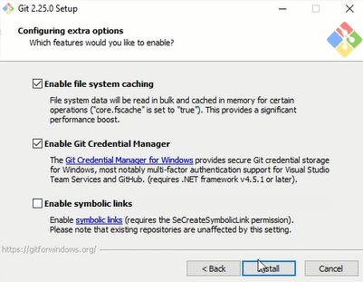

#Установка Git

Для начала необходимо проверить установлен ли Git на ПК 
Для этого в командной строке/терминале вводим 
`git --version`

Если Git уже установлен, то в командной строке/терминале отобразится версия программы. Например 
`git version 2.35.1`

В случае отсутствия - появится сообщение 
`Command 'git' not found`

Порядок установки Git отличается в зависимости от операционной системы ПК. Ниже описан порядок действий для каждой ОС 

---

##Windows
1. Пройти по ссылке. [ Установка Git для Windows](https://git-scm.com/download/win)
2. Проверить разрядность ОС и скачать соответсвующий дистрибутив установки. 
`Мой компьютер --> ПКМ --> Свойства` 
В поле "Тип системы" будет указана 34 или 64 разрядная версия
3. Выбрать путь папки для установки
4. Проставить необходимый перечень расширений **"Select Components"** 
5. выбрать редактор используемый по умолчанию для работы с Git **"Choosing the default editor used by Git"** 
6. выбрать доступность GIT 
7. оставшиеся параметры установки оставлять по умолчанию и запустить установку 

##Linux
1. Войти в терминал
2. Ввести команду `$ sudo apt install git`
3. Готово 	

##MacOS
1. Войти в терминал
2. Ввести команду `xcode-select --install`
3. Подтвердить установку
4. Готово
